# Get Spotify Stats

## Info
* This is a fun personal project that utilizes the Spotify API to show Spotify stats including your recently played songs, top songs, and top artists.
* This is also a great way to find some new songs to add to your mix, through the recommended songs tab.
* The homepage also displays a Discover Weekly to find some songs that are popular at the current moment.
* This is strictly for fun and personal use!!!

### Feedback/Tips
* Please leave any feedback, and if you have any tips and are willing to help out, please reach out to aksharcommit@gmail.com 

## How to run locally

1. #### Fork repository or clone locally
    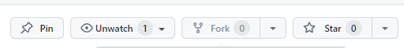
    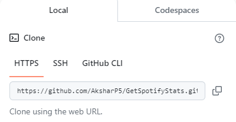

2. #### Download all requirements
    ```
    pip install -r requirements.txt
    ```
3. #### Obtain Spotify API key 
    1. Go to the [Spotify API page](https://developer.spotify.com/documentation/web-api/tutorials/getting-started) 
    2. Follow instructions, and create an app
    3. Locate your app on the [developer dashboard](https://developer.spotify.com/dashboard)
    4. Click on app and go to settings
    5. Locate Client ID and Client Secret 
    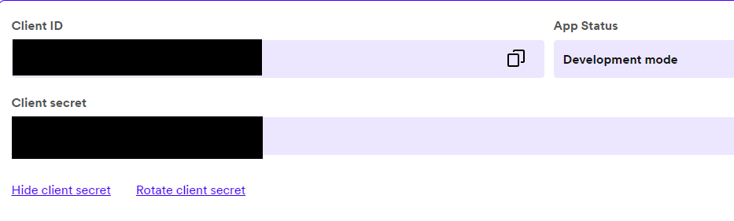
    6. Set redirect URIs
    
        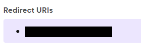

4. #### Set Environment Variables
    1. Create a .env file in the root
    2. Create variables for CLIENT_ID, CLIENT_SECRET, and REDIRECT_URL (Don't include the brackets)
    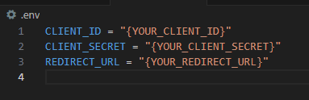

5. #### Start the application
    ```
    python app.py
    ```
    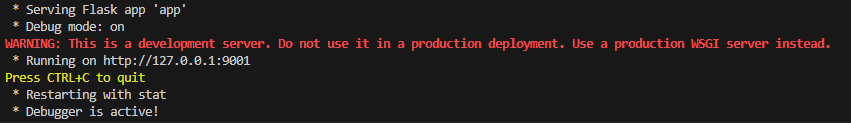

6. #### Enjoy!
    - Ctrl + Click on server

## How It Should Look

- ### Homepage
    

- ### Recent Songs
    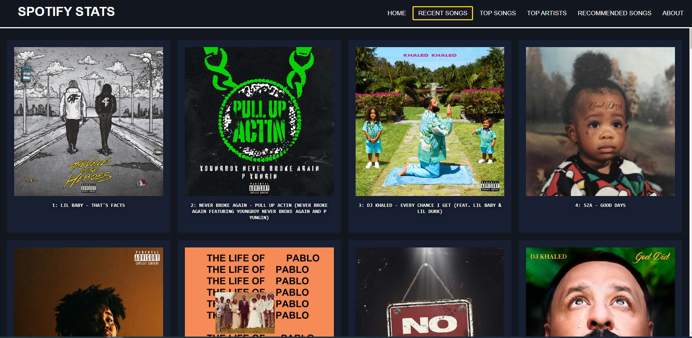

- ### Top Songs
    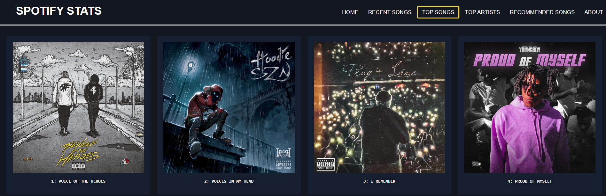

- ### Top Artists
    

- ### Recommended Songs
    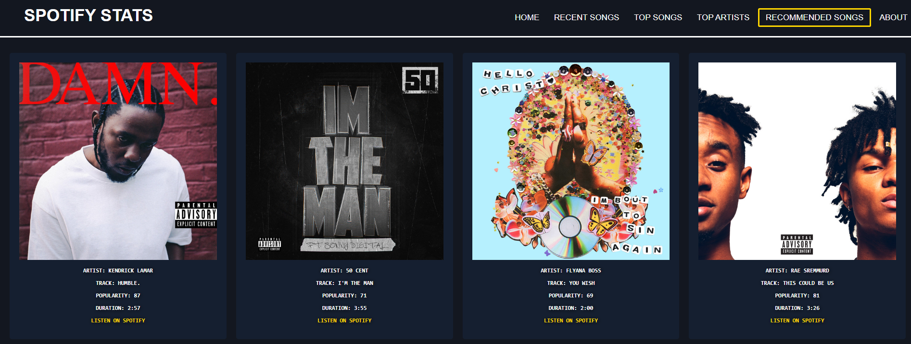

- ### About
    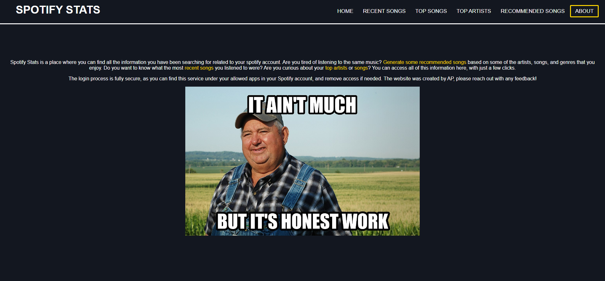

- ### Invalid Input
    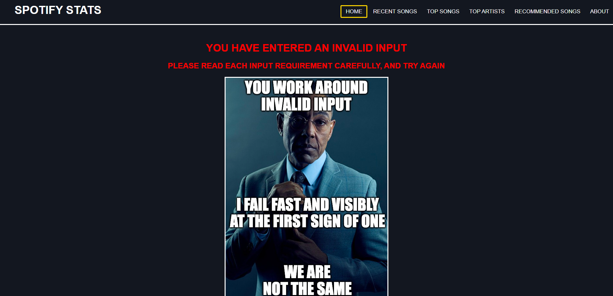